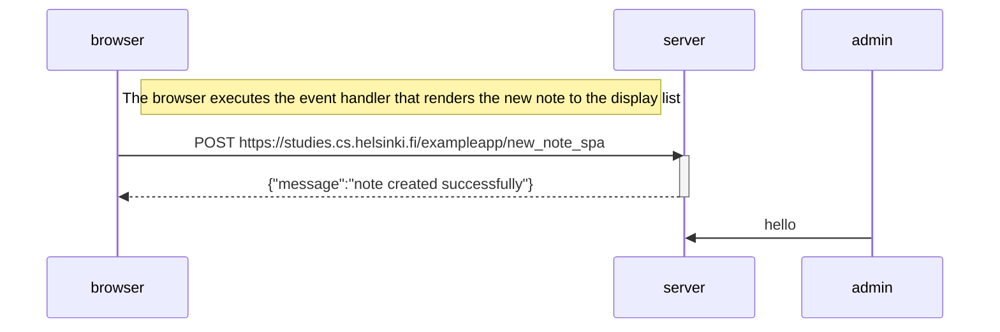

```mermaid
sequenceDiagram
    participant browser
    participant server
    participant admin

    Note right of browser: The browser executes the event handler that renders the new note to the display list

    browser->>server: POST https://studies.cs.helsinki.fi/exampleapp/new_note_spa
    activate server
    server-->>browser: {"message":"note created successfully"}
    deactivate server

    admin->>server: hello
```
